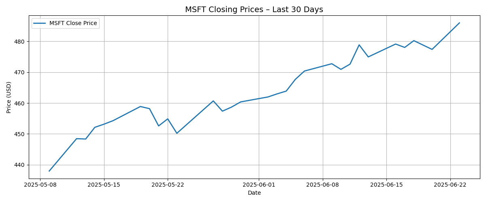

# msft-30day-analysis
30-day stock price analysis of Microsoft (MSFT) using yfinance and matplotlib

## Features
- 30-day historical price chart
- 10-day SMA and EMA overlays
- Cumulative returns
- Daily log returns
- 5-day rolling volatility
- 14-day RSI (momentum indicator)

## Chart

