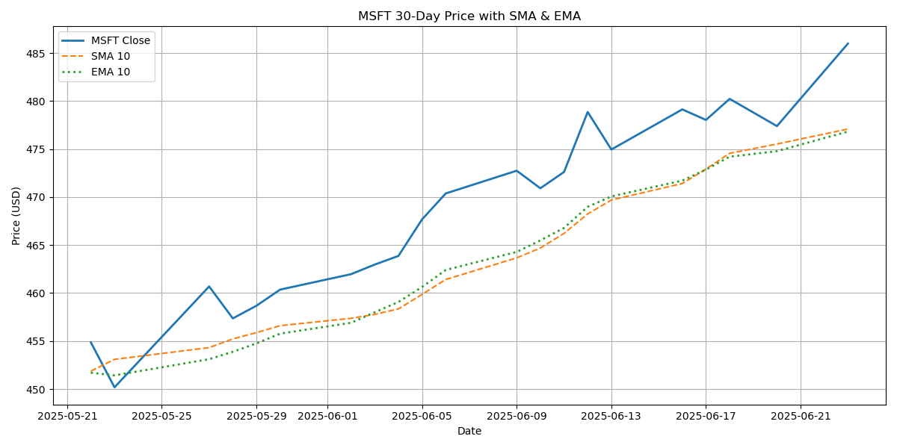
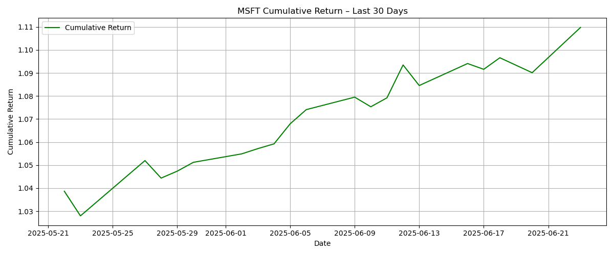
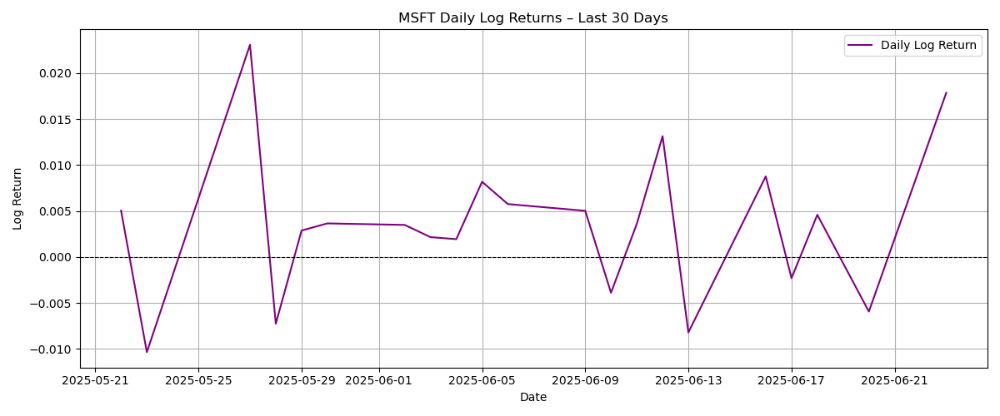
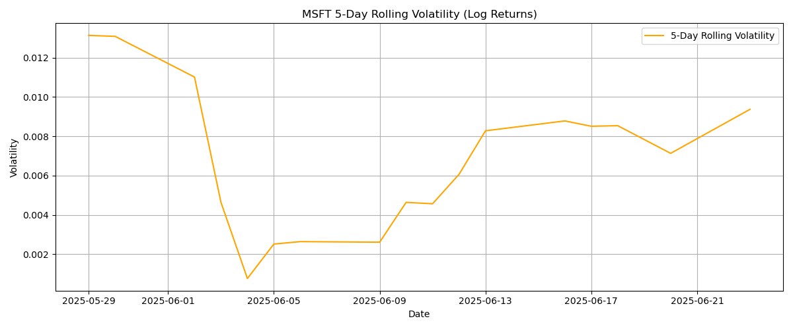
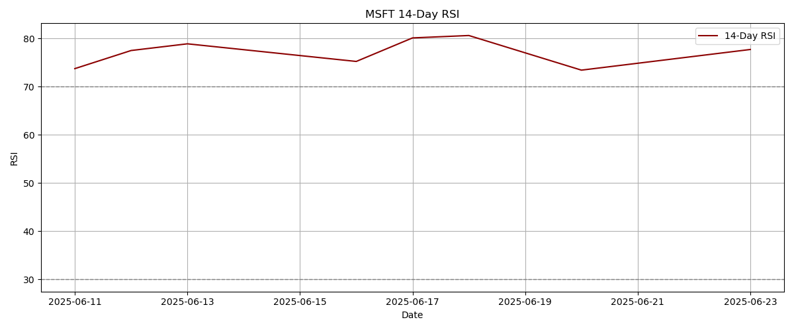

# MSFT-30Day-analysis
30-day stock price analysis of Microsoft (MSFT) using yfinance and matplotlib

## Features
- 30-day historical price chart
- 10-day SMA and EMA overlays
- Cumulative returns
- Daily log returns
- 5-day rolling volatility
- 14-day RSI (momentum indicator)

## Summary Report
**Date:** 2025-06-24  
**Latest Close Price:** $486.00  
**Cumulative Return (30 days):** 10.98%  
**5-Day Rolling Volatility (latest):** 0.0094  
**14-Day RSI (latest):** 77.69

### Interpretation:
- The cumulative return shows the stock has moved **+10.98%** over the past month.  
- Current volatility level indicates a **relatively calm** market.  
- RSI is at **77.69**, suggesting the stock is **overbought (RSI > 70)**.

## Visual Analysis

### 1. Price with SMA & EMA

### 2. Cumulative Return

### 3. Daily Log Returns

### 4. Rolling Volatility

### 5. RSI (Relative Strength Index)

